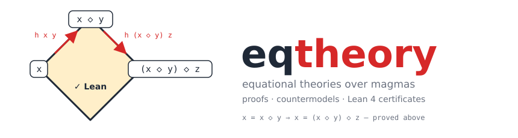

<p align="center"></p>

<p align="center">
<a href="https://pypi.org/project/eqtheory/"></a>
<a href="https://github.com/osick/eqtheory/actions/workflows/ci.yml"></a>
<a href="https://pypi.org/project/eqtheory/"></a>
<a href="LICENSE"></a>
</p>

# eqtheory

A Python library for **equational theories over magmas**: given two
equations in one binary operation `◇`, decide whether the first implies
the second — and hand back a **Lean 4 certificate** either way.

* term rewriting with a ground **Knuth–Bendix order**, one-way matching,
  unification,
* a proof-producing **e-graph** (congruence closure with a proof forest,
  shortest shared explanations) and **equality saturation**,
* **ordered completion** and **goal-directed superposition** with
  replayed proof chains, interreduction and node budgets,
* **finite countermodels**: symbolic linear families, structured tables,
  a complete propagating cell search and a **CDCL** SAT search with
  symmetry breaking (exhaustion verdicts are proofs),
* **infinite countermodels on ℕ** for *Austin pairs* (true in every
  finite magma, false in general),
* **Lean 4 certificates** for every answer — self-contained files that
  check with a plain Lean 4 toolchain (no Mathlib) — and a compile check,
* an optional, hygienic **LLM stage** with a configurable prompt,
* a **CLI** with e-graph and proof **visualisation** (SVG/PNG/DOT).

The algorithms are those of the SAIR Stage-2 solver (800/800 practice,
see the paper in [osick/SAIR-callenges](https://github.com/osick/SAIR-callenges/tree/main/challenge_02/docs/paper)),
re-packaged with a clean API. Pure Python 3.11+,
no required dependencies.

## Install

```bash
pip install eqtheory                 # from PyPI (Python ≥ 3.11, no required dependencies)
pip install "eqtheory[viz]"          # + graphviz bindings for image rendering (needs the `dot` binary)
```

For development:

```bash
git clone https://github.com/osick/eqtheory.git && cd eqtheory
pip install -e ".[viz,dev]" && python -m pytest
```

## Quick start

```python
from eqtheory import Problem, solve

p = Problem.parse("x = y ◇ (x ◇ y)", "x = (x ◇ y) ◇ x")
ans = solve(p)
print(ans.verdict, ans.stage)   # "true" / "false", which engine decided
print(ans.code)                 # the Lean 4 certificate
```

Each engine is a plain function:

```python
from eqtheory import prove_by_superposition, find_countermodel, residue_affine_countermodel, prove_goal
from eqtheory.lean import certs

pr = prove_by_superposition(p.hypothesis, p.goal)       # lemma + instantiation + derived set
cm = find_countermodel(p.hypothesis, p.goal, time_budget=60)   # Countermodel(n, table) or None
nm = residue_affine_countermodel(p.hypothesis, p.goal)  # ℕ model for Austin pairs
eg, l, r = prove_goal(p.hypothesis, p.goal)             # e-graph with the goal sides merged
lemmas, chain = eg.explain(l, r)                        # shared proof, replayable
eg.render("egraph.svg", highlight=(l, r))               # picture
```

## Command line

```bash
eqtheory solve "x = y ◇ (x ◇ y)" "x = (x ◇ y) ◇ x"                # full ladder, prints certificate
eqtheory solve --lean --json ...                                # certificate compiled with Lean
eqtheory prove ...                                              # superposition only
eqtheory model --infinite --cert ...                            # countermodels, finite then ℕ
eqtheory egraph --render egraph.svg --lemmas ...                # saturate and draw the e-graph
eqtheory viz-proof --out proof.dot ...                          # the extracted proof as a graph
eqtheory cert --table "[[0,1],[1,0]]" ...                       # wrap a table as a certificate
```

`--lean` needs a Lean 4 toolchain — `lean` on the `PATH` (an [elan](https://github.com/leanprover/elan)
install is found automatically) or the `lean_bin` setting; certificates
are self-contained and pinned to the `lean_toolchain` setting (default
the validated `leanprover/lean4:v4.33.1`, which elan fetches on first
use). `--llm` needs the API key named by `llm_api_key_env` (default
`OPENROUTER_API_KEY`). All defaults are settings: `eqtheory.toml`,
`EQTHEORY_*` variables or `eqtheory.configure(...)` — `eqtheory config`
shows the effective values (see the [guide](docs/guide.md#configuration)).

## Documentation

* [User guide](docs/guide.md) — the pipeline, budgets, composing your own ladder
* [Mathematical background](docs/background.md) — the theory behind each engine, with references
* [Certificates](docs/certificates.md) — the Lean shapes and the proof-policy lessons
* [API overview](docs/api.md)
* [Limitations](docs/limitations.md) — theoretical and pragmatic
* [Releasing](docs/releasing.md) — moving to its own repository, CI, tags, PyPI
* `examples/single_file_solver.py` — a complete solver in 60 lines
* `artifacts/` — sample renderings and benchmark reports
* `scripts/make_logo.py` — the logo above is generated from a real solve (the e-graph proof of `x = x ◇ y ⇒ x = (x ◇ y) ◇ z`)

## Status

Version 0.3.0 (2026-09-01). Tests: `python -m pytest` (83 tests; the Lean
tests skip themselves when no toolchain is installed). Benchmark (2026-09-01, 200-problem stress set shipped in
`artifacts/problems/`, every self-contained certificate compiled with a
plain Lean 4 toolchain, LLM never needed): **200/200 correct** — see
`artifacts/bench-stress-2026-09-01-standalone/REPORT.md`.

## Limitations (short form)

Implication between magma laws is undecidable; every engine is budgeted,
so "no answer" is not a verdict. Finite search is complete per size but
cannot see infinite-only countermodels beyond the ℕ residue-class family;
`decide`-checked tables grow with n^(variables); `grind`
certificates are Lean-version-sensitive; the LLM stage adds hygiene, not reach. Details and
measurements: [docs/limitations.md](docs/limitations.md).

License: MIT.
